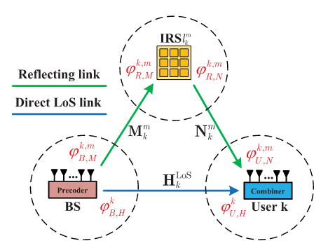
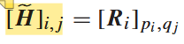
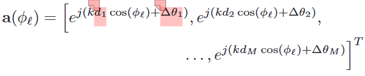
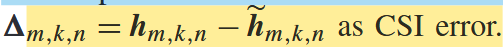
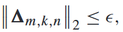
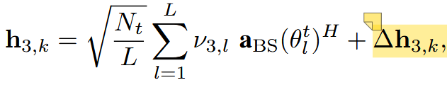

# 总体研究框架

## 初期研究问题

### 待确认问题

- 目前没有找到太多关于波束训练后信道误差模型的文章，需要进一步确认研究过程中实际使用的误差模型
- 系统模型有哪些地方设置需要修改或是细化？
- 角度域误差改成有界误差模型行不行？

### 系统模型

假设信道互易性，上行波束训练，下行波束赋形。
BS（B离开角）-（R到达角）RIS（相移）（R离开角）-UE_k。

RIS辅助的MU-MISO系统，基站端部署**混合预编码结构**，在波束赋形优化问题之前引入**用户聚类**方法，**联合优化BS端数字预编码和RIS端相移**。由于初期研究，所以简化了BS端模拟域设计，一种方法是直接假设其固定，另一种是指出其相干时间较长，可以减少其优化频率。[1]

信道模型采用**毫米波多径模型**，信道估计方法采用基于码本的波束训练方法，可以得到估计的角度和path loss值，信道误差模型针对这两部分建立。[2] [3]

注意与传统MIMO系统中波束训练后得到单个角度的结果相区分，**RIS系统中**对级联信道进行波束训练后，在模拟域上得到的是 <u>【BS离开角+RIS相移】</u>这样一个beam pair，如果用户多天线，甚至将扩展为 <u>【BS离开角+ RIS相移 + UE到达角】</u> 这样的波束对，其估计结果中的信息缺失是较为严重的，所以针对带有误差的信道模型优化很有必要。[4]

### 相关数学模型

- [2]中，对信道增益系数的估计方式简单、但精度有限，RSS数值直接作为估计的H元素值。

其中R是接收信号强度矩阵。

- [3]中，利用波束训练获取信道的主导角度信息（如到达角AoA、离开角AoD），然后通过LS估计路径增益，最终重构信道矩阵。

其中B是估计出的角度域导向矢量、数字域预编码器的复合矩阵，$\alpha$是路径增益，文中设置为大尺度衰落增益系数。

- 波束训练过程中常常需要面对“beam misalignment”问题，其中概率性地出现实际波束-最优波束之间的差距。我们针对beamforming优化，暂时不考虑这个问题。[7]

- 实际上，由于码本的离散特性，即使选择了最优波束，也很可能和现实中的角度有一定的偏差，[5]中，将这种误差建模成steering向量中的相位误差，并假设这个误差变量服从**高斯分布**。

- 针对传统的信道估计方式得到的信道，[6]中提到，如果估计精度较低，则更适用于概率误差模型；如果估计精度较高，对于量化、有限反馈场景，更适用于有界误差模型。

- 前人研究中，针对RIS结构，已经引入了phase-dependent amplitude（PDA）模型和phase error模型。

### 一些说明

- 低精度ADC对波束训练的影响较大，目前没有找到相关文献。
- RIS相移的主要设计目标为对齐BS、UE之间的角度差，BS端数字域处理用户干扰。可以分为两个阶段各自处理以降低复杂度，但两者互相反馈、联合优化或许能达到更好的性能。

## 之后的计划

### 这一周干什么

- [8]->[9]->[10]是已有研究的优化路线，[8]和[10]有代码，已经复现[8]，需要继续复现[10]，在[10]的基础上改进。
- [8]是针对SE做优化，[9]针对MSE做优化，[10]针对最差MSE做优化，先效仿[1] [6]推导一下这些公式中有没有可以简化的地方。

## 引用文献

[1] Deep Reinforcement Learning Based Beamforming  Codebook Design for RIS-aided mmWave Systems
[2] Beam Training and Allocation for Multiuser  Millimeter Wave Massive MIMO Systems
[3] Hybrid Driven Learning Aided Beam Tracking in  Air-to-Ground MIMO-OFDM Communications
[4]Terahertz Multi-User Massive MIMO With  Intelligent Reflecting Surface: Beam  Training and Hybrid Beamforming
[5] Reinforcement Learning of Beam Codebooks in  Millimeter Wave and Terahertz MIMO Systems
[6]Robust Beamforming With Partial Channel State  Information for Energy Efficient Networks
[7] A Multi-User High Accuracy Beam Training  Algorithm For MmWave Communication
[8] Deep Reinforcement Learning Based Joint  Downlink Beamforming and RIS Configuration in  RIS-aided MU-MISO Systems Under Hardware  Impairments and Imperfect CSI
[9] MSE minimization for RIS-Assisted Wireless  Networks with Phase Error and Phase-dependent  Amplitude Response
[10] Worst-case MSE Minimization for RIS-assisted  mmWave MU-MISO Systems with Hardware  Impairments and Imperfect CSI
