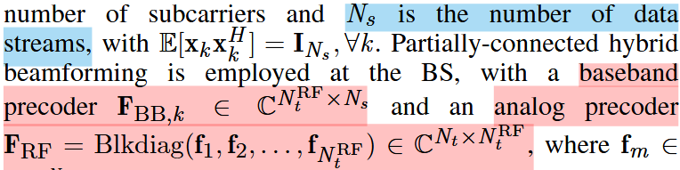
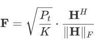
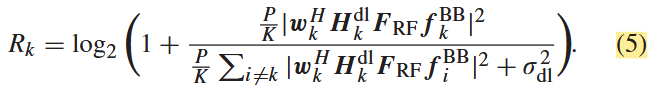
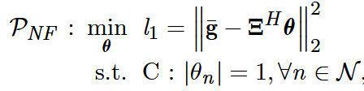

# 研究记录

## 实验情况

### 混合预编码模型

模拟域预编码器的设置：BS-RIS端有两个相关角度，BS端的AOD和RIS端的AOA，那么模拟预编码器的责任是消除AOD影响还是两个角度的联合影响呢？

- 先来看**混合预编码的维度设置**[1]

    

    图中，RF（模拟域）precoder的维度是：传输天线数量 * 射频链路数量
    BB（数字域）precoder的维度是：射频链路数量 * 数据流数量

- 再来看**RIS-BS段信道维度**
  是Ns*Nt -- RIS反射元件数量 * BS传输天线数量

- 好了不用看了，问了AI老师了，F_RF没能力同时处理两个角度，只能处理BS端的AOD，而RIS相移则需要同时考虑入射角度（此段AOA）和反射角度（到用户的AOD）
- 数字预编码矩阵怎么设置？这里使用MRT方法，如图中模型
      
    但是需要注意，假设H是级联信道，那么维度为：（单天线）用户数量 * BS传输天线数，这个和之前设想的维度：射频链路数量 * 数据流数量 是无法兼容的。
- 所以出现了新问题，混合预编码 + RIS中，怎样设置数字预编码? 话说我感觉就算没有RIS，维度还是不匹配，问题还是存在，所以是否混合预编码场景下就无法使用传统的线性数字预编码器？是的，但是加上模拟域预编码器之后就可以解决维度匹配的问题了。
- [ ] 但是直接在地位信道上应用MRT方法我估计性能应该不太好，需要调研一些混合预编码结构优化论文，三篇吧就差不多了。
- 混合预编码结构下的性能评判指标之 -- **用户和速率**[2]
  
  
- 混合预编码结构下的性能评判指标之 -- **用户和速率**[2]

### RIS+多用户

**RIS到底是如何服务于多用户的？** 在看到[3]聚类后的不同角度簇用户走同一条BS-RIS信道到达RIS后，我觉得有必要搞清楚这个问题。

1. 这个问题在论文[4]中，又称为多波束设计问题。文中指出，通常的单用户场景下，单独设计用户与RIS之间的最佳反射角度，但是转移到多用户场景下时，直接叠加多个用户的最佳反射波束配置会造成 很大的性能损失。文中提出多波束设计问题为：
  
  其中g是K个用户的波束增益系数组成的向量，$\Sigma $  是N-K维RIS-UE信道，$\theta $ 是待优化变量，或者说RIS的N*1反射相位。
  这个就相当于联合优化多个角度了。
2. 另一种方式是[3] [5]了，将RIS分为多个子阵列，每个子阵列各自学习一个目标角度。

另一个问题是，**服务于哪些用户呢？** 我们想要对用户进行聚类、筛选，那么每个时刻Nk个用户（假设用户数量是固定的）就是不完全相同的，是需要筛选的。

- 假设用户的筛选过程和beamforming过程不分离，那就需要智能体选择最优的服务对象，同时还要探索对这几个对象而言最优的赋形方案，从智能体的角度来说，很可能会对所有可能用户都进行一遍性能推演之后，才能选择出结果，这显然是效率很低的。
- 假设通过用户聚类将用户分成了多个角度簇，但是怎样在角度簇内进行选择呢？用户的组合似乎也是一个难以优化的问题。
- 目前参考的文献[3]中，聚类过程，首先需要构造【用户*感知波束】维度的RSS矩阵，可以直接沿用，根据 [2]，数字域预编码器不参与信道估计过程。
- 按照[3]所提方法聚类后，如何选择用户呢？emm，看[7]，Ⅴ.A、Ⅴ.B小节，似乎是对一个簇设计一个码字，但这篇论文的目的是码本设计，我们的目的是波束赋形，两者侧重点并不完全一致。
  所以我们不能完全按照这个方案。我想，得到角度簇后，根据一定规律选出用户后，还是需要将 **具体的信道估计信息** 输入智能体，以达到更个性化的服务，提高性能表现。

### 波束训练下的RIS系统模型

如[4]所示，可以单独考虑BS-RIS和RIS-UE两段信道。

### 信道误差模型改变后

### 不同算法比较

## 理论情况

### 【重要】波束训练+混合预编码结构细节更改

RIS相关配置参考[3] [5] ，但混合预编码结构细节必须基于[2]详细的信道估计过程。

- 对**模拟域**，角度上的高斯误差模型应当作为理论模型使用，参考[2]，工程实现时设立模拟域码本，仿照波束训练的过程，选择离现实角度最近的角度对。当然由于码本本身限制，肯定会存在角度偏差，理论模型就是为了表征这个实际误差，这是一个可以想办法让智能体进行学习的理论知识。
- 对**模拟域**，参考[3] [5]，可以将RIS相移和实际信道分离开来。参考[6] [4]，可对RIS-UE、RIS-BS两小段信道进行搜索训练。
- 对**数字域**，结合上述两点，根据现有的RIS相移和估计信道设计，或者把这个设计归纳进智能体设计中。
- 如果按照第一点设计，其实可以引入DeepMIMO数据集合，这样可以方便地验证各种信道下的表现。

### 最主要的改变是信道误差模型，这个改变对公式有什么影响，我记得前人研究有相关推导可以借鉴

## 引用文献

[1] ?
[2] Beam Training and Allocation for Multiuser  Millimeter Wave Massive MIMO Systems
[3] Multi-Agent Deep Reinforcement Learning for  Beam Codebook Design in RIS-Aided Systems
[4] Multi-Beam Design for Near-Field Extremely  Large-Scale RIS-Aided Wireless Communications
[5] Fast Beam Training for IRS-Assisted Multiuser Communications
[6] Terahertz Multi-User Massive MIMO With Intelligent Reflecting Surface: Beam Training and Hybrid Beamforming
[7] Reinforcement Learning of Beam Codebooks in  Millimeter Wave and Terahertz MIMO Systems
