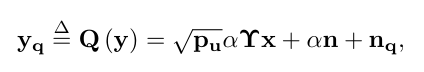

## 系统模型

N天线的BS服务于K个单天线用户，上行系统。BS部署低精度ADC，使用AQNM量化模型。使用MRC接收器。

### 阵列响应向量

理想的阵列响应向量如下：

\[{\mathbf{a}}(\phi ) = {[1,{e^{ - jk\cos (\phi )}},{e^{ - jk2\cos (\phi )}}, \cdots ,{e^{ - jk(N - 1)\cos (\phi )}}]^T} \in {\mathbb{C}^{N \times 1}}\]

假设通过波束训练算法找到了与LOS角度最接近的码字波束，并测量了该波束角度下的增益系数，那么估计出的信道为：

\[{{\mathbf{\tilde h}}_k} = {\beta _0}{\mathbf{a}}(\phi _k^{(0)}) \in {\mathbb{C}^{N \times 1}}\]

从而MRC combiner为：

\[{{\mathbf{w}}_k} = {\beta _0}{\mathbf{a}}(\phi _k^{(0)}) \in {\mathbb{C}^{N \times 1}}\]

但是由于存在估计失误、码本量化精度受限、硬件限制等因素，实际的信道必然和估计结果之间存在相位差距，使用高斯分布对相位误差进行建模[1]：

\[{\mathbf{\tilde a}}(\phi ) = {[1 \cdot {e^{j\Delta {\theta _0}}},{e^{ - jk\cos (\phi )}} \cdot {e^{j\Delta {\theta _1}}},{e^{ - jk2\cos (\phi )}} \cdot {e^{j\Delta {\theta _2}}}, \cdots ,{e^{ - jk(N - 1)\cos (\phi )}} \cdot {e^{j\Delta {\theta _{N - 1}}}}]^T} \in {\mathbb{C}^{N \times 1}}\]

其中 \(\Delta \theta  \sim {\text{N(0,}}{\sigma ^2}{\text{)}}\)，实验中设置$\sigma ^2 = 0.1 {\text{ (rad)}} $。

### 信道模型

假设存在一条强度明显更高的LOS路径和多条强度较弱的散射路径共同组成了毫米波信道[2]：

  \[
  \mathbf{h} = \beta_0 \tilde{\mathbf{a}}(\varphi_0) + \sum_{l=1}^L \beta_l  \tilde{\mathbf{a}}(\varphi_l),
  \]
  其中，增益系数服从复高斯分布[3]：
  \[{\beta _0} \sim {\text{CN}}(0,1),{\beta _l} \sim {\text{CN}}(0,{10^{ - 1}})\]
  实验中设置NLOS分径数L=2。

### 量化模型

且量化噪声方差计算式为[5]中(9)式：
\[\begin{array}{l}
{{\bf{R}}_{{{\bf{n}}_{\bf{q}}}{{\bf{n}}_{\bf{q}}}}} = E\left\{ {{{\bf{n}}_{\bf{q}}}{\bf{n}}_{\bf{q}}^H\left| {\bf{H}} \right.} \right\}\\
 \approx \alpha \left( {1 - \alpha } \right)E\left\{ {{{\bf{y}}_{\bf{q}}}{\bf{y}}_{\bf{q}}^H} \right\}\\
 = \alpha \left( {1 - \alpha } \right)diag\left( {{p_u}{\bf{H}}{{\bf{R}}_{{\bf{xx}}}}{{\bf{H}}^H} + {{\bf{R}}_{{\bf{nn}}}}} \right)\\
 = \alpha \left( {1 - \alpha } \right)diag\left( {{p_u}{\bf{H}}{{\bf{H}}^H} + {\bf{I}}} \right)
\end{array}\]

## 用户和速率推导工作

### 接收信号向量

到达BS端后对接收信号进行量化，再使用MRC combiner处理多用户数据，最终得到接收信号向量为：

\[{\bf{z}} = {{\bf{W}}^H}{{\bf{y}}_{\bf{q}}} = \sqrt {{p_u}} \alpha {{\bf{W}}^H}{\bf{Hx}} + \alpha {{\bf{W}}^H}{\bf{n}} + {{\bf{W}}^H}{{\bf{n}}_{\bf{q}}}\]

对用户k，其接受信号为：

\[{z_k} = \sqrt {{p_u}} \alpha {\bf{w}}_k^H{{\bf{h}}_k}{x_k} + \sqrt {{p_u}} \alpha \sum\limits_{m = 1,m \ne k}^K {{\bf{w}}_k^H{{\bf{h}}_m}{x_m}}  + \alpha {\bf{w}}_k^H{\bf{n}} + {\bf{w}}_k^H{{\bf{n}}_q}\]

这四个因子分别代表目标用户信号、其他用户干扰、高斯白噪声、量化噪声。

### 用户和速率

用户k的可达速率的计算式为：
\[{R_k} = {\log_2}\left( {1 + {\rm{SIN}}{{\rm{R}}_k}} \right)\]

其中：
\[{\rm{SIN}}{{\rm{R}}_k} = \frac{{{p_u}{\alpha ^2}{{\left| {{\bf{w}}_k^H{{\bf{h}}_k}} \right|}^2}}}{{{p_u}{\alpha ^2}\sum\limits_{m = 1,m \ne k}^K {{{\left| {{\bf{w}}_k^H{{\bf{h}}_m}} \right|}^2} + {{\left| {{\bf{w}}_k^H{{\bf{n}}_q}} \right|}^2} +  {\alpha ^2} {{\left\| {{\bf{w}}_k^H} \right\|}^2}} }}\]

分别记：
\[{B_1} = {\left| {{\mathbf{w}}_k^H{{\mathbf{h}}_k}} \right|^2},{B_2} = {\left| {{\mathbf{w}}_k^H{{\mathbf{h}}_m}} \right|^2},{B_3} = {\left| {{\mathbf{w}}_k^H{{\mathbf{n}}_q}} \right|^2},{B_4} = {\left\| {{\mathbf{w}}_k^H} \right\|^2}\]

所有用户的和速率为：
\[{\text{R}} = E\left[ {\sum\limits_{k = 1}^K {{R_k}} } \right]\approx \sum\limits_{k = 1}^K {{\text{E}}\left[ {{R_k}} \right]} \]

### 近似闭式计算式

根据[4] Lemma 1，将用户k速率的均值计算简化为：

\[\begin{array}{l}
{R_k} = E\left\{ {{{\log }_2}\left( {1 + \frac{{{p_u}{\alpha ^2}{B_1}}}{{{p_u}{\alpha ^2}\sum {{B_2}}  + {B_3} + {\alpha ^2}{B_4}}}} \right)} \right\}\\
 \approx {\log _2}\left( {1 + \frac{{{p_u}{\alpha ^2}E\{ {B_1}\} }}{{{p_u}{\alpha ^2}\sum {{\rm{E}}\{ {B_2}\} }  + {\rm{E}}\{ {B_3}\}  + {\alpha ^2}{\rm{E}}\{ {B_4}\} }}} \right)
\end{array}\]

经推导得到：
- \[\mathbb{E}[{B_1}] = N + N(N - 1){e^{ - {\sigma ^2}}} +    \sum\limits_{l = 1}^L 0 .1\left[ {N + {e^{ - {\sigma ^2}}}\left( {{{\left| {\frac{{\sin (N{\delta _l}/2)}}{{\sin ({\delta _l}/2)}}} \right|}^2} - N} \right)} \right],\]
  其中 \(\delta_{l} = k (\cos(\varphi_0) - \cos(\varphi_l))\). 
  
- \[\mathbb{E}[{B_2}] = \left[ {N + {e^{ - {\sigma ^2}}}\left( {\frac{{{{\sin }^2}\left( {N{\delta _{m0}}/2} \right)}}{{{{\sin }^2}\left( {{\delta _{m0}}/2} \right)}} - N} \right)} \right] + \sum\limits_{p = 1}^L 0 .1\left[ {N + {e^{ - {\sigma ^2}}}\left( {\frac{{{{\sin }^2}\left( {N{\delta _{mp}}/2} \right)}}{{{{\sin }^2}\left( {{\delta _{mp}}/2} \right)}} - N} \right)} \right].\]
  其中 \({\delta _{mp}} = k(\cos ({\varphi _{k0}}) - \cos ({\varphi _{mp}}))\). 

- \[\begin{array}{l}
  \mathbb{E}[B_3] = \mathbb{E} \left[ {{\bf{w}}_k^Hdiag\left( {{{\bf{R}}_{{{\bf{n}}_{\bf{q}}}{{\bf{n}}_{\bf{q}}}}}} \right){{\bf{w}}_k}} \right]\\
  = \alpha (1 - \alpha ) \sum\limits_{n = 0}^{N - 1} { |\beta_0 |^2 {{\left| {{e^{ - jkn\cos ({\varphi _0})}}} \right|}^2} \cdot \mathbb{E} {{[{p_u}{\bf{H}}{{\bf{H}}^H} + {\bf{I}}]}_{n,n}}} \\
  = \alpha (1 - \alpha ){N\left[ K{{p_u}(1 + 0.1L) + 1} \right]}.
  \end{array} \]

- \({\mathbb{E}}[B_4] = N\).

## 实验解读及补充工作

### 单元测试

固定参数为 \( N=128,L=2,p_u=10(dB),\sigma^2=0.1(rad),b=3 (bit)\) 时，

- 对信号能量（$B_1$部分）作了monte-closed对比实验，数值情况：
  - Monte mean : [137901.78414085 140373.48060967 138584.5955601  138450.91142021
  138785.17847137]
  - Closed form: [138324.23081112 138322.94191025 138321.78188978 138321.54002709
  138389.56448648]
  - Max error  : 2.051e+03，即约为1.5%。

- 对干扰能量（$B_2$部分）作了monte-closed对比实验，数值情况：
  - Monte mean : [641.84555904 637.69806575 734.04768374 677.25864946 711.69765581]
  - Closed form: [635.4604728  641.84166271 728.1558662  677.71017593 711.26515674]
  - Max error  : 6.385e+00，即约为0.1%。
- 量化误差、高斯白噪声误差很小。

由于高估了信号能量、低估了干扰能量，且信号能量数值很高，最终和速率闭式计算式大约高估10%-20%，误差还是有点大，存在优化空间。

### 不同参数变化下的性能情况

篇幅过长，另写文件。

### 补充/延申工作

后续加上一些补充工作充实论文
或者延申一些优化应用

## 论文改写

### Introduction

- **原论文**
  Massive MIMO 是 5G/6G 核心技术，通过大规模天线阵列实现高谱效与鲁棒性。线性检测器（如 MRC）在低 SNR 下表现优异，且当天线数趋于无穷时，用户信道趋于正交。然而，每根天线配备独立 RF 链（含高精度 ADC）导致功耗激增（~250mW/链），限制系统规模化部署。
  低分辨率 ADC 成为降低功耗的有效方案。已有研究基于 AQNM 模型分析了 1–4 bit 量化对上行谱效的影响，并验证 MRC 检测器的适用性。但这些工作均假设信道正交（天线数→∞），忽略实际有限物理空间导致的**信道相关性**与**有限维特性**（路径数 P ≪ 天线数 N）。
  另一方面，beamspace 变换与波束/天线选择技术被广泛用于降低计算复杂度，但尚未与低分辨率 ADC 下的有限维信道分析相结合。
  本文首次针对**有限维信道**下的上行 Massive MIMO 系统，结合 **低分辨率 ADC（AQNM 模型）** 与 **MRC 检测**，推导谱效近似表达式，并分析天线数、发射功率、量化位数等关键参数的影响。同时，扩展特征值驱动的**天线选择机制**，进一步降低系统成本。
- **改写版**
  围绕毫米波大规模MIMO系统的功耗问题，提出分别针对CSI估计阶段、通信阶段引入的节能措施：波束训练、低精度ADC。基于这两项核心技术引入了对应的误差模型：相位误差模型、AQNM量化模型，继而对随机误差推导出用户和速率的期望闭式计算式，探讨两个关键技术引入的误差对性能的影响情况。

## 参考文献

[1] Reinforcement Learning of Beam Codebooks in Millimeter Wave and Terahertz MIMO Systems 
[2] Millimeter Wave Channel Modeling and Cellular Capacity Evaluation
[3] Near-Optimal Beam Selection for Beamspace MmWave Massive MIMO
[4] SystemsPower Scaling of Uplink Massive MIMO Systems with Arbitrary-Rank Channel Means
[5] Performance Analysis of UCA-OAM Systems With Low-Resolution ADCs
