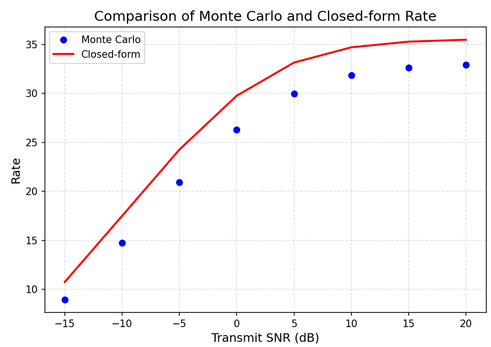
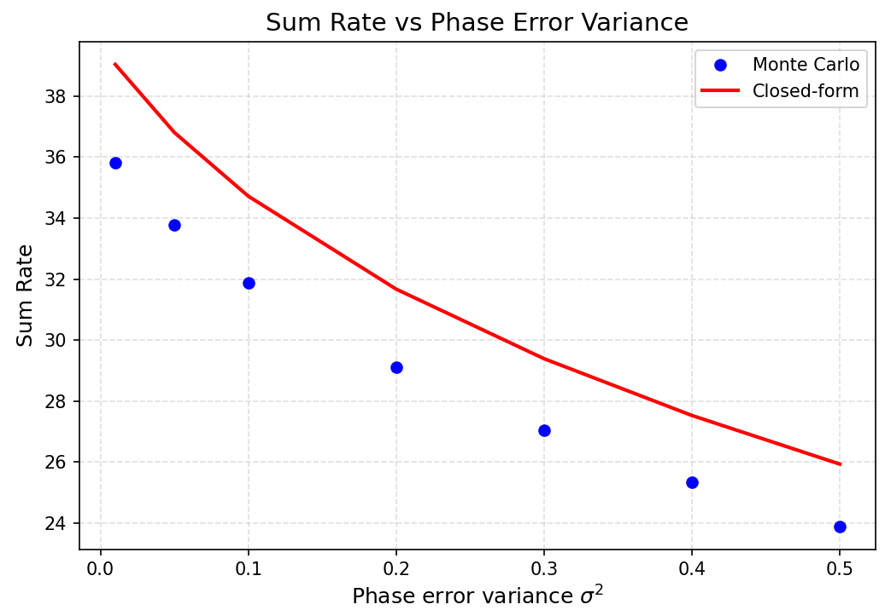
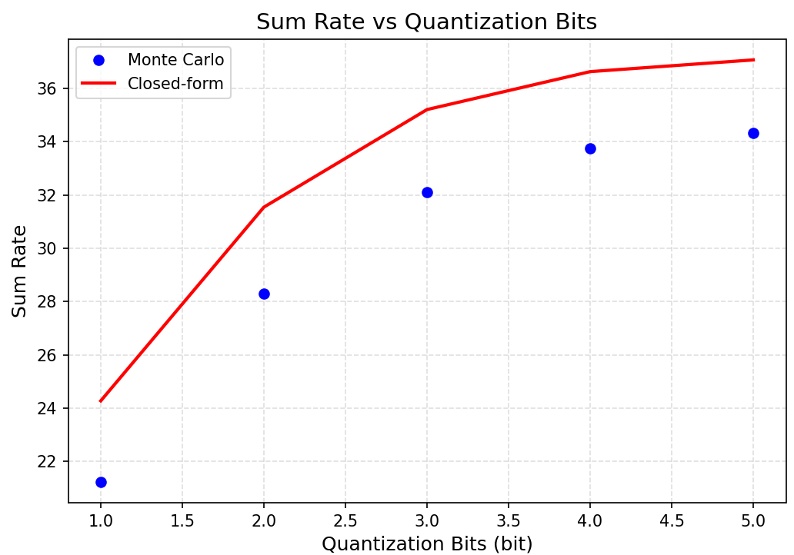

## 实验情况

### SNR

- R_monte_mean are [ 8.96848795 14.74681916 20.94167144 26.29394611 29.98602944 31.870427
32.64945249 32.93783754]
- R_closed are [10.76297888 17.50050632 24.27225814 29.77156057 33.16065544 34.71608441
 35.29419023 35.48803107]
- Error ratio are [19.96%,18.65%,15.97%,13.25%,10.56%,8.93%,8.11%,7.75%]

### 相位误差分布方差$\sigma^2$

- sigma2_list: [0.01, 0.05, 0.1, 0.2, 0.3, 0.4, 0.5]
- R_monte_mean: [35.80560273 33.76148507 31.88718326 29.10137961 27.05037393 25.32799974
 23.89642264]
- R_closed: [39.03713058 36.80379434 34.71608441 31.66940067 29.38890558 27.52766686
 25.93327013]
- Error ratio are [9.02% 9.01%  8.87%  8.82% 8.64% 8.68% 8.52%]

### 量化比特位bit
- bit_list: [1, 2, 3, 4, 5]
- R_monte_mean: [21.23867277 28.30428816 32.12008133 33.75164303 34.32257794]
- R_closed: [24.27292482 31.54590016 35.20889754 36.63306928 37.07288435]
- Error ratio are [14.28% 11.45%  9.61%  8.53%  8.01%]
