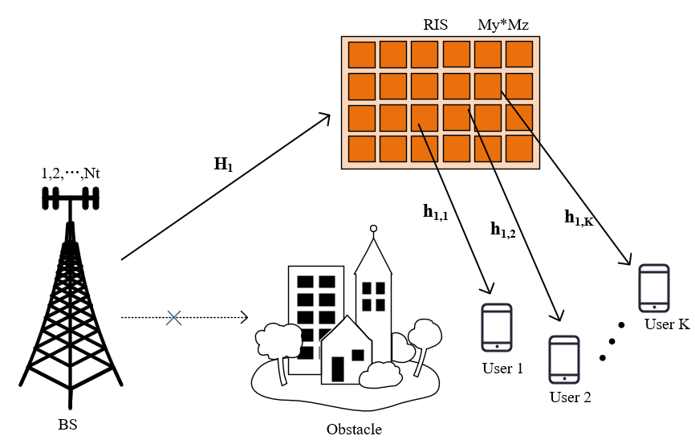
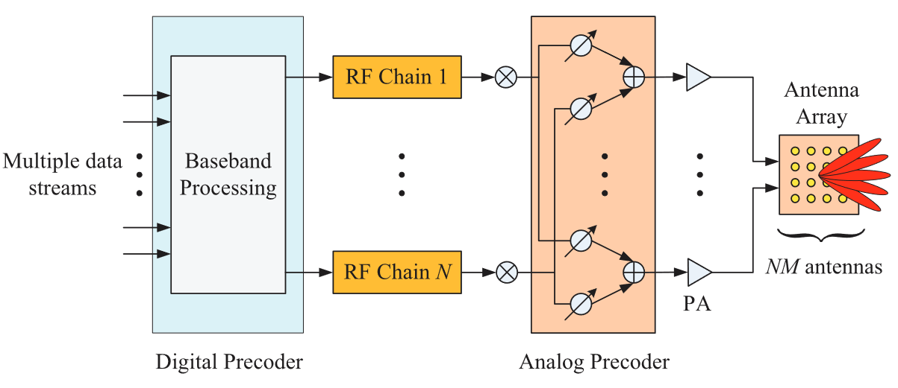

# 实验具体情况

## 讨论目的

- 和老师同步研究进展和信息
- 校准研究路线，确认研究情况

## 现有进展

### 通信场景总览

总的通信场景如下图所示：

考虑基站端部署ULA阵列，同时服务于K个单天线用户，在该下行MU-MISO系统中，BS-UE直连信道被阻塞，通过中间的RIS反射面板构建出一个级联通信信道。

基站端采用下图所示的全连接混合预编码结构，模拟域预编码器记为 $\mathbf{F}_{RF}$，数字域预编码器记为 $\mathbf{F}_{BB}$，并设RF链路数量$ N_{RF}=K $。

### 接收信号模型

根据信号传播情况，建立 **初始的接收信号模型：**
\[ {{\text{y}}_k} = {\mathbf{h}}_{2,k}^T{\mathbf{\Phi }}{{\mathbf{H}}_1} \cdot {{\mathbf{F}}_{RF}}{{\mathbf{F}}_{BB,k}} \cdot x_k + {n_k} \]

其中，约束条件：。。。

为了方便智能体预测RIS相移，建立 **相关的级联信道模型：**
\[ {{\mathbf{D}}_k} = {\text{diag}}({{\mathbf{h}}_{2,k}}){{\mathbf{H}}_1} \in {\mathbb{C}^{{N_s} \times {N_t}}} \]

其中，采用Saleh-Valenzuela (SV) 信道模型生成信道数据：

\[{{\mathbf{H}}_1} = {{\mathbf{a}}_{RIS}}({\gamma _{AOA}},{\eta _{AOA}}){{\mathbf{a}}_{BS}}{({\theta _{AOD}})^H} \in {\mathbb{C}^{Ns \times Nt}}\]

\[{{\mathbf{h}}_{2,k}} = {{\mathbf{a}}_{RIS}}({\gamma _{AOD}},{\eta _{AOD}}) \in {\mathbb{C}^{Ns \times 1}}\]

这时，接收信号模型转化为：
\[ {{\text{y}}_k} = {\phi ^T}{{\mathbf{D}}_k} \cdot {{\mathbf{F}}_{RF}}{{\mathbf{F}}_{BB,k}} \cdot x_k + {n_k},\phi  = diag({\mathbf{\Phi }}) \in {\mathbb{C}^{Ns \times 1}} \]

### 误差模型[]

波束训练过程结束后，估计出天线阵列的AOD、AOA在码本中对应的索引，由此得到的角度就是估计信道信息，为了表征离散码本、波束失配的问题，推算实际性能时，阵列响应矢量使用的角度都引入了离散误差 ：
\[\tilde \theta   = {\text{ }}\theta  + \Delta \theta ,\Delta \theta  \in N(0,{\delta ^2})\]

### 性能指标

两种指标，根据具体情况选择。

第一种，用户和速率，第k个用户的可达速率计算式为：
\[{R_k} = {\log _2}(1 + \frac{{{{\left| {{\phi ^T}{{\mathbf{D}}_k}{{\mathbf{F}}_{RF}}{{\mathbf{f}}_{BB,k}}} \right|}^2}}}{{\sum\limits_{j \ne k} {{{\left| {{\phi ^T}{{\mathbf{D}}_k}{{\mathbf{F}}_{RF}}{{\mathbf{f}}_{BB,j}}} \right|}^2} + \sigma _n^2} }})\]

第二种，接收信号MSE，计算式为：

该式是

尝试过化简单个用户k的MSE元素计算式，主要目的是消除噪声和信道变量，但卡在$ E({\phi ^T}{{\mathbf{D}}_k}{{\mathbf{F}}_{RF}}{{\mathbf{F}}_{BB,k}})$ 这一步，${\phi ^T} $ 和 ${{\mathbf{F}}_{BB,k}}$虽然可以作为确定值直接得到期望，但这两个矩阵和信道矩阵 ${{\mathbf{D}}_k}$ 之间的相关性使得期望难以分解。

### 强化学习

最基本的三个构成元素为：

- State: ${{\mathbf{s}}_{t + 1}} = [{\mathbf{\tilde D}},{{\mathbf{a}}_t}]$
- Action: ${{\mathbf{a}}_t} = [\phi ,{\text{real}}({{\mathbf{F}}_{BB}}),{\text{imag}}({{\mathbf{F}}_{BB}})]$
- Reward: $r_{t} = \sum\limits_k^K {{R_k}} $

目前使用的是PPO算法，引入了最新的Stable-baseline3库，可以快速实现目前流行的算法如。。。，由此可以得到多个基准算法的性能对比数据。

### 具体问题

-  $\mathbf{F}_{RF}$ 对智能体来说是固定的，那么具体如何设置的？
- 为什么不用预先设想的用户聚类？
- 模型和代码实现上，具体怎样体现出波束训练这个特殊背景的？

## 下一步计划

- 目前得到初步的数据

## 引用文献

[1] Reinforcement Learning of Beam Codebooks in  Millimeter Wave and Terahertz MIMO Systems
[2] Multi-Agent Deep Reinforcement Learning for  Beam Codebook Design in RIS-Aided Systems
