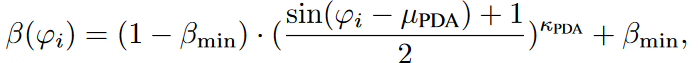
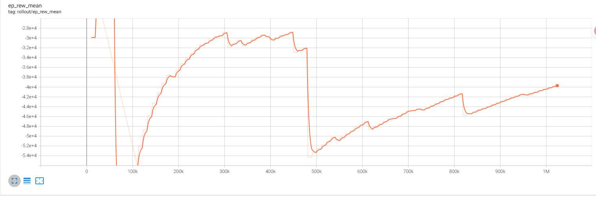
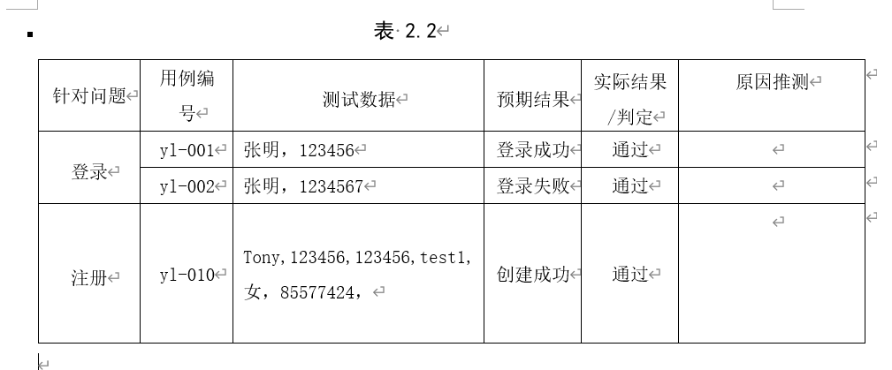

# 实验具体情况

## 讨论目的（deprecated）

- 和老师同步研究进展和信息
- 校准研究路线，确认研究情况

## 现有进展

### 通信场景总览

总的通信场景如下图所示：

考虑基站端部署ULA阵列，同时服务于K个单天线用户，在该下行MU-MISO系统中，BS-UE直连信道被阻塞，通过中间的RIS反射面板构建出一个级联通信信道。

基站端采用下图所示的全连接混合预编码结构，模拟域预编码器记为 $\mathbf{F}_{RF}$，数字域预编码器记为 $\mathbf{F}_{BB}$，并设RF链路数量$ N_{RF}=K $。

### 接收信号模型

根据信号传播情况，建立 **初始的接收信号模型：**
\[ {{\text{y}}_k} = {\mathbf{h}}_{2,k}^T{\mathbf{\Phi }}{{\mathbf{H}}_1} \cdot {{\mathbf{F}}_{RF}}{{\mathbf{F}}_{BB}} \cdot x + {n_k} \]

其中，约束条件：
\[ {\text{C1:}}\quad  {\text{tr}}\left( {{{\mathbf{F}}_{BB}}{\mathbf{F}}_{BB}^H} \right) \leqslant {P_t}\]\[{\text{C2:}}\quad {\phi _n} \in [0,2\pi )\]

为了方便智能体预测RIS相移，建立 **相关的级联信道模型：**
\[ {{\mathbf{D}}_k} = {\text{diag}}({{\mathbf{h}}_{2,k}}){{\mathbf{a}}_{RIS}}({\gamma _{AOA},{\eta _{AOA}})} \in {\mathbb{C}^{{N_s} \times {1}}} \]

具体的信道数据采用Saleh-Valenzuela (SV) 信道模型生成：

\[{{\mathbf{H}}_1} = {{\mathbf{a}}_{RIS}}({\gamma _{AOA}},{\eta _{AOA}}){{\mathbf{a}}_{BS}}{({\theta _{AOD}})^H} \in {\mathbb{C}^{Ns \times Nt}}\]

\[{{\mathbf{h}}_{2,k}} = {{\mathbf{a}}_{RIS}}({\gamma _{AOD}},{\eta _{AOD}}) \in {\mathbb{C}^{Ns \times 1}}\]

这时，用户k的接收信号模型转化为：
\[ {{\text{y}}_k} = {\phi ^T}{{\mathbf{D}}_k} \cdot {{\mathbf{F}}_{RF}}{{\mathbf{F}}_{BB}} \cdot x + {n_k} \]

其中 $ \phi  = diag({\mathbf{\Phi }}) \in {\mathbb{C}^{Ns \times 1}}$

因为发送给所有用户的信号都是一样的，即 $\mathbf{F}_{RF} \mathbf{F}_{BB} \cdot x$，故将所有用户经过的级联信道组合后，得到**实际的级联信道模型：**

\[{\mathbf{\tilde D}} = {\phi ^T}{[{{\mathbf{D}}_1},{{\mathbf{D}}_2}, \cdots ,{{\mathbf{D}}_K}]^T} \in {\mathbb{C}^{K \times {N_t}}}\]

### 误差模型

**波束训练误差模型：**
波束训练过程结束后，估计出天线阵列的AOD、AOA在码本中对应的索引，由此得到的角度就是估计信道信息，为了表征离散码本、波束失配的问题，推算实际性能时，阵列响应矢量使用的角度都引入了离散误差 ：
\[\tilde \theta   = {\text{ }}\theta  + \Delta \theta ,\Delta \theta  \in N(0,{\delta ^2})\]

**RIS反射耦合模型：**
RIS反射信号的幅度与反射相位想耦合，之前的研究采用PDA模型表述：

### 性能指标

两种指标，根据具体情况选择。

第一种，用户和速率，第k个用户的可达速率计算式为：
\[{R_k} = {\log _2}(1 + \frac{{{{\left| {{\phi ^T}{{\mathbf{D}}_k}{{\mathbf{F}}_{RF}}{{\mathbf{f}}_{BB,k}}} \right|}^2}}}{{\sum\limits_{j \ne k} {{{\left| {{\phi ^T}{{\mathbf{D}}_k}{{\mathbf{F}}_{RF}}{{\mathbf{f}}_{BB,j}}} \right|}^2} + \sigma _n^2} }})\]

第二种，接收信号MSE，计算式为：

\[{\text{E[}}\left\| {{\mathbf{y}}{\text{ - }}{\mathbf{x}}} \right\|_2^2{\text{] = }}\left( {{{\mathbf{I}}_K} - {\mathbf{\tilde DF}}} \right){\left( {{{\mathbf{I}}_K} - {\mathbf{\tilde DF}}} \right)^H} + \sigma _n^2{{\mathbf{I}}_K}\]

尝试过**化简单个用户k的MSE元素计算式**，主要目的是消除噪声和信道变量，但卡在$ E({\phi ^T}{{\mathbf{D}}_k}{{\mathbf{F}}_{RF}}{{\mathbf{F}}_{BB,k}})$ 这一步，虽然可以将 ${\phi ^T} $ 和 ${{\mathbf{F}}_{BB,k}}$ 作为确定值直接得到期望，但这两个矩阵和信道矩阵 ${{\mathbf{D}}_k}$ 之间的相关性使得期望难以分解。

### 强化学习

最基本的三个构成部分为：

- State: ${{\mathbf{s}}_{t + 1}} = [\text{real}({\mathbf{D}}),\text{imag}({\mathbf{D}}),{{\mathbf{a}}_t}]$ ，共 $2*K*N_s+N_s+2*K^2$ 个元素
- Action: ${{\mathbf{a}}_t} = [\phi ,{\text{real}}({{\mathbf{F}}_{BB}}),{\text{imag}}({{\mathbf{F}}_{BB}})]$，设RF链数量等同于用户数量，则共 $N_s+2*K^2$ 个元素
- Reward: $r_{t} = \sum\limits_k^K {{R_k}}$

### 一些细节

- 模型和代码实现上，具体怎样体现出波束训练这个特殊背景的？
    答：数学模型上，用以训练智能体的信道数据都是带有相位角度误差的毫米波信道模型。具体实现时，将在码本范围内随机采样一个波束角度，设为波束训练的结果，基于这个结果，加入随机相位误差，由此得到**真实的信道矩阵**和**角度取值于码本的估计矩阵**。

-  $\mathbf{F}_{RF}$ 在目前的设想中对智能体来说是固定的，那么具体如何设置的？
    答：直接设置为BS-RIS这段信道的出发角度（AOD）对应的阵列导向矢量，并且是使用基于码本的估计矩阵，所以模拟域预编码元素的取值是离散、有限范围的。

- 为什么不用预先设想的用户聚类？
    答：第一个问题是，对用户聚类完成后**不同时刻选择什么用户**的问题。在参考的使用用户聚类的原文章中，算法的优化目标是对每个用户簇设计全局最好的码本元素，但在脱离码本范围后，如何设计出能使得用户和速率全局最优的问题是原文方法无法解决的。
    当然，这个问题可以通过将用户选择加入智能体决策范围解决，这样能够更好地开发出强化学习的固有优势，但这就引出第二个问题，就是**工作量会增加**，智能体的优化工作会更复杂。所以综合考虑下，决定将这个工作用作后续提升，目前先专注于解决简化版问题。

## 工作进度

这几天干了什么，为什么要干这些，对之后的工作有什么意义
这一周其实主要是在熟悉工具Stable-baseline3库，这是新论文开源代码所使用的强化学习算法库，基于这个结构标准的、算法齐全的库，可以更方便快速地实现目前流行的算法例如PPO和SAC在自定义环境上的性能对比。
不过问题在于，这个库没有相关教程，所以要实现数据监控等自定义功能的话就需要自己摸索，与全自写代码比起来这个地方会有点麻烦。
最近就从日志记录这个功能出发，利用AI熟悉了库的大致结构，并实现了一些基本的数据记录回调功能，对性能曲线有了更深刻的理解。

 
例如这个图中，其实曲线是由一段一段的阶梯线组成，只是tensorboard展示图形时自动平滑处理了。而阶梯线是由于SB3设置的打印频率和我设置的环境数据更新频率不匹配，即，一个10K步的episode内每2K步记录一次数据，然而env只在episode结尾才更新返回的info，导致前四次打印都是重复数据。
此外，曲线在479.2K-481.3K步间开始骤降，这是第46个episode的步数，那么为了分析这种性能突变的原因，就需要加入异常数据监控、经验历史回放、或是奖励分布可视化等功能。

## 测试用例（初步构想）

主要是测试功能实现、参数调控的效果。结构如下图：

### 参数设置

